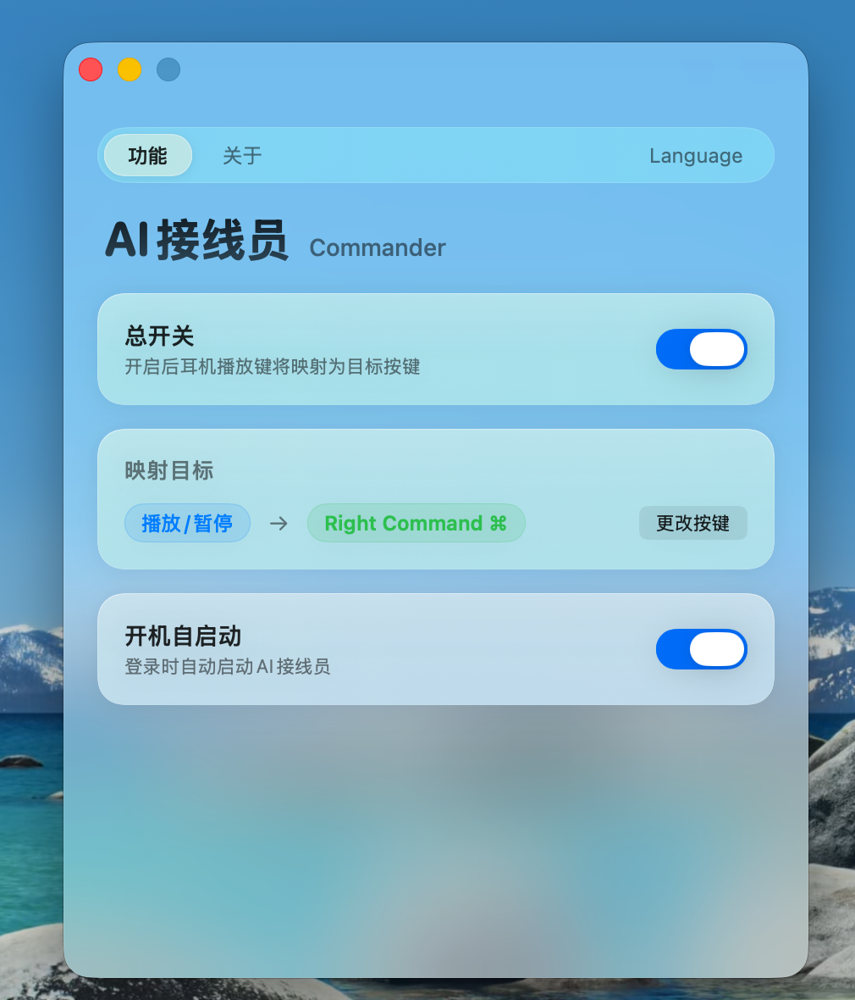

<div align="center">


# AI 接线员 · AI Commander

**用耳机上的「播放 / 暂停」键，一键接通你的 AI，开口说话即可 vibe coding**
*Turn the play/pause button on your earphones into a direct line to your AI — just pick up and talk.*


[](https://github.com/YuJonny/AI-Commander/releases)

[中文](#中文) · [English](#english)


⭐ **觉得有用，点个 Star 支持一下** · *If it helps, a Star means a lot.*

<sub>语音输入 · 媒体键映射 · 快捷键 · push-to-talk · voice input · hotkey · vibe coding · 接线员 · macOS · Windows</sub>

</div>

---

<a id="中文"></a>

## 中文

### 缘起

很久以前，打电话是一件需要「接线员」的事。

你拿起听筒，最先接通的不是对方，而是一位接线员 —— TA 安静地守在线路的另一端，听你说要找谁，再亲手为你把线接过去。那是一个有人情味的年代：每一次接通的背后，都站着一个「人」。

后来，接线员消失了，电话变快了，人也变远了。

而现在，是 AI 的时代。我常常想：要是还有这样一部电话呢？

它不通向另一座城市，倒更像一台小小的**时空穿梭机** —— 线路的另一端，是我的电脑。它随时待命，随时可以接起，听我说话，替我办事。

每当我戴上耳机、按下那颗最普通的按钮，我都觉得自己不是在「打开一个软件」，而是在**拨通一通电话** —— 接起的，是这个时代的接线员：一个永远在线、替我转接一切的智能。

**AI 接线员**，就是那部电话。它把你耳机上那颗最不起眼的播放键，变成你与 AI 之间的「接通键」。

### 两个用它的理由

**1️⃣ 一点浪漫 ☎️**
在一个到处是冰冷界面的时代，它让你重新找回「拿起电话、和谁说说话」的那点仪式感。要是再配上一台复古电话听筒，**时代的反差感**会更迷人 —— 旧时代的躯壳里，住着这个时代最聪明的灵魂。

**2️⃣ 它是真的好用 —— 我称之为 Vibe Coding 的终极形态 🎯**
1. **无感** —— 拿起电话，按一下拨号键，就能直接开口；不用找窗口，不打断手头的事。
2. **免充电、免维护** —— 有线耳机不像蓝牙耳机要天天充电，没有续航焦虑，几乎零维护。
3. **切换极简** —— 换设备只需「一拔一插」，不必反复蓝牙配对。

### ✨ 功能

- 🎧 监听耳机的「播放 / 暂停」媒体键
- ⌨️ 映射成任意按键 —— 默认 macOS = 右 Command，Windows = 右 Alt
- 🪟 常驻菜单栏 / 系统托盘，一键开关
- 🚀 支持开机自启
- 🍎 + 🪟 macOS 与 Windows 双平台

### 截图

<div align="center">

</div>

### 下载安装

前往 [**Releases**](https://github.com/YuJonny/AI-Commander/releases/latest) 下载：

| 平台 | 文件 |
|---|---|
| macOS | `AI.Commander_Mac.dmg` |
| Windows | `AI.Commander_Win.exe` |

#### 🍎 macOS 首次打开（重要）

本应用未做苹果公证，首次打开可能提示「已损坏」或「来自身份不明的开发者」。**这是正常的，软件本身没有问题**，二选一即可：

- **简单法**：双击 App → 打开「系统设置 → 隐私与安全性」→ 在「安全性」一栏点 **「仍要打开」** → 验证。
- **兜底法（终端）**：打开「终端」，粘贴并回车：
  ```bash
  sudo xattr -cr /Applications/AI接线员.app
  ```
- DMG 里也附带了图文版「⚠️ 打不开看这里.txt」。

> 另外，macOS 需要在 **系统设置 → 隐私与安全性 → 辅助功能** 中**勾选「AI接线员」**，否则无法拦截/发送按键。

#### 🪟 Windows 首次打开

- 未签名，**SmartScreen** 会拦一下：点 **「更多信息 → 仍要运行」**。
- 杀毒软件（Windows Defender / 360 / 火绒）可能因为程序使用「键盘钩子」而**误报**，需要在杀软里把它**加入信任 / 白名单**。
- 单文件免安装，x64，Windows 10/11 双击即用，**无需管理员权限、无需安装 .NET**。

### 使用方法

1. 打开 App，确保**主开关已开启**（macOS 记得给「辅助功能」权限）。
2. 在「映射目标」里把目标键设成你想要的键（例如你常用语音输入软件的快捷键）。
3. 按耳机的「播放 / 暂停」键 —— 即触发你设定的那个键。

### 🧩 推荐搭配使用

- 🎙️ **[Typeless](https://www.typeless.com/?via=jonny)** —— 语音输入软件。不只是快速把语音转成文字，还会自动校准、去口语化，直接整理成结构化的输出。
- ☎️ **[Native Union 复古电话听筒](https://s.click.taobao.com/t?e=m%3D2%26s%3DwIrhGUcHebRw4vFB6t2Z2ueEDrYVVa6424t41fwIvtDRnNAdhLhtk430ZFekjizvxL1QHRKL8qiA5rFvxyOF9bwBMngvQdOvBQ7ZDE%2F6%2BIeRXNdY%2BjBkB5eYDQwFj6yC8kftjCRdkjx9Tuff7Tu%2FYJiUD8YEbaigH9ofgWr0NEuwIB%2BqTHya4ovEYPUpsQ%2FF2%2BRbLWXc2uZ5pCmcDdfSii21iRm1aQiYoGwWYjQ2nPkzWlhic%2BUoh0NEJ7GOeqvGxg5p7bh%2BFbQ%3D)** —— Apple Store 入驻产品，市面上质感最好的复古听筒。我试过各种价位的，只有它的线材拉扯时几乎毫无阻力，外形也很适合桌面搭配。

### 🔒 隐私与安全

这类软件需要「全局监听媒体键 + 模拟按键」，天然容易被怀疑。我们的做法是**完全开源、可审计**：

- ✅ 只拦截「媒体播放 / 暂停」**这一个键**，只发出**你配置的那一个键**；
- ✅ **不记录、不读取**你输入的任何内容；
- ✅ **不联网、不收集、不上传**任何数据；
- ✅ 核心逻辑就在 [`KeyRelay/MediaKeyInterceptor.swift`](KeyRelay/MediaKeyInterceptor.swift) 与 [`Commander-Windows/MediaKeyInterceptor.cs`](Commander-Windows/MediaKeyInterceptor.cs)，欢迎自行审查。
- ℹ️ 杀软 / Gatekeeper 之所以会提示，正是因为「键盘钩子」这个**行为本身**，与是否恶意无关 —— 源码公开，就是为了让你放心。

### 从源码构建

**macOS**（需 Xcode 命令行工具）：
```bash
./build.sh      # 编译通用二进制（Intel + Apple Silicon）并自动签名 → AI接线员.app
```

**Windows**（需 .NET 8 SDK）：双击 `Commander-Windows/一键编译.bat`（自动检测 .NET 并编译），或手动：
```bash
cd Commander-Windows
dotnet publish -c Release -r win-x64 --self-contained true -p:PublishSingleFile=true
```

### 致谢 / 第三方组件

- Windows UI：[WPF-UI](https://github.com/lepoco/wpfui)（MIT）、[H.NotifyIcon.Wpf](https://github.com/HavenDV/H.NotifyIcon)（MIT）
- macOS 仅使用 Apple 系统框架（SwiftUI / AppKit / CoreGraphics）

详见 [THIRD_PARTY_NOTICES.md](THIRD_PARTY_NOTICES.md)。

### 许可证

[MIT](LICENSE) © 2026 Jonny Yu

---

<a id="english"></a>

## English

### The story

Long ago, making a phone call meant going through an *operator*.

You'd lift the handset, and the first voice on the line wasn't the person you wanted — it was an operator, waiting quietly at the other end, listening for who you were trying to reach, then patching you through by hand. It was a more human age: behind every connection stood a person.

Then the operators vanished. Calls got faster; people drifted further apart.

And now it's the age of AI. I keep wondering — what if a phone like that still existed?

Not one that reaches another city, but a little **time machine** — and at the other end of the line is my computer. Always on call, ready to pick up, to listen, to get things done for me.

Every time I put on my earphones and press that one ordinary button, it doesn't feel like *opening an app*. It feels like **placing a call** — and the one who answers is the operator of this new era: an intelligence that's always on the line, patching everything through for me.

**AI Commander** is that phone. It turns the most unassuming play button on your earphones into the "connect" button between you and your AI.

### Two reasons to use it

**1️⃣ A little romance ☎️**
In an age of cold interfaces, it brings back the ritual of *picking up the phone to talk to someone*. Pair it with a retro handset and the **contrast across eras** only gets sweeter — the smartest soul of this age, living inside the shell of an older one.

**2️⃣ It's genuinely good — the final form of vibe coding 🎯**
1. **Frictionless** — pick up the "phone", press the dial button, and just talk. No window to find, no flow to break.
2. **No charging, no upkeep** — wired earphones never need charging like Bluetooth buds; no battery anxiety, virtually zero maintenance.
3. **Switch in a snap** — moving between devices is just unplug-and-plug, no endless Bluetooth re-pairing.

### ✨ Features

- 🎧 Listens for your earphones' play / pause media key
- ⌨️ Remaps it to any key — default: **Right Command** on macOS, **Right Alt** on Windows
- 🪟 Lives in the menu bar / system tray, toggle on/off anytime
- 🚀 Launch at login
- 🍎 + 🪟 Both macOS and Windows

### Screenshot

<div align="center">

</div>

### Download & Install

Grab the latest build from [**Releases**](https://github.com/YuJonny/AI-Commander/releases/latest):

| Platform | File |
|---|---|
| macOS | `AI.Commander_Mac.dmg` |
| Windows | `AI.Commander_Win.exe` |

#### 🍎 First launch on macOS (important)

The app is **not notarized**, so the first launch may say "damaged" or "unidentified developer". **This is expected — the app is fine.** Pick one:

- **Easy way:** double-click → **System Settings → Privacy & Security** → under *Security* click **"Open Anyway"** → authenticate.
- **Fallback (Terminal):**
  ```bash
  sudo xattr -cr /Applications/AI接线员.app
  ```

You also need to enable **AI接线员** under **System Settings → Privacy & Security → Accessibility**, otherwise it can't intercept/send keys.

#### 🪟 First launch on Windows

- Unsigned, so **SmartScreen** will warn: click **"More info → Run anyway"**.
- Antivirus (Defender / 360 / Huorong) may **false-positive** because the app uses a keyboard hook — add it to your AV's **allowlist / trusted** list if needed.
- Single-file, portable, x64, runs on Windows 10/11 — **no admin rights and no .NET install required**.

### Usage

1. Open the app and make sure the **master switch is on** (grant Accessibility on macOS).
2. Under **Mapping Target**, set the target key to whatever you want (e.g. your voice-input app's hotkey).
3. Press your earphones' play / pause button — it fires the key you chose.

### 🧩 Recommended pairings

- 🎙️ **[Typeless](https://www.typeless.com/?via=jonny)** — a voice-input app. More than fast speech-to-text: it auto-corrects, strips spoken filler, and turns your words into clean, structured output.
- ☎️ **[Native Union retro handset](https://s.click.taobao.com/t?e=m%3D2%26s%3DwIrhGUcHebRw4vFB6t2Z2ueEDrYVVa6424t41fwIvtDRnNAdhLhtk430ZFekjizvxL1QHRKL8qiA5rFvxyOF9bwBMngvQdOvBQ7ZDE%2F6%2BIeRXNdY%2BjBkB5eYDQwFj6yC8kftjCRdkjx9Tuff7Tu%2FYJiUD8YEbaigH9ofgWr0NEuwIB%2BqTHya4ovEYPUpsQ%2FF2%2BRbLWXc2uZ5pCmcDdfSii21iRm1aQiYoGwWYjQ2nPkzWlhic%2BUoh0NEJ7GOeqvGxg5p7bh%2BFbQ%3D)** — sold in the Apple Store; the best-made retro handset I've found. After trying many at every price, only this one's cable pulls with zero resistance, and the shape sits beautifully on a desk.

### 🔒 Privacy & Security

This kind of tool needs "global media-key listening + synthetic key events", which understandably invites suspicion. Our answer is **fully open source and auditable**:

- ✅ It intercepts **only** the media play/pause key, and emits **only** the single key you configured.
- ✅ It does **not** log or read anything you type.
- ✅ It makes **no network connections** and collects / transmits **no data** whatsoever.
- ✅ The core logic lives in [`KeyRelay/MediaKeyInterceptor.swift`](KeyRelay/MediaKeyInterceptor.swift) and [`Commander-Windows/MediaKeyInterceptor.cs`](Commander-Windows/MediaKeyInterceptor.cs) — read it yourself.
- ℹ️ AV / Gatekeeper warnings come from the **keyboard-hook behavior itself**, not from anything malicious — the source is public precisely so you can verify.

### Build from source

**macOS** (Xcode command-line tools required):
```bash
./build.sh      # builds a signed universal (Intel + Apple Silicon) AI接线员.app
```

**Windows** (.NET 8 SDK required): double-click `Commander-Windows/一键编译.bat` (auto-detects .NET and builds), or manually:
```bash
cd Commander-Windows
dotnet publish -c Release -r win-x64 --self-contained true -p:PublishSingleFile=true
```

### Acknowledgements / Third-party

- Windows UI: [WPF-UI](https://github.com/lepoco/wpfui) (MIT), [H.NotifyIcon.Wpf](https://github.com/HavenDV/H.NotifyIcon) (MIT)
- macOS uses only Apple system frameworks (SwiftUI / AppKit / CoreGraphics)

See [THIRD_PARTY_NOTICES.md](THIRD_PARTY_NOTICES.md).

### License

[MIT](LICENSE) © 2026 Jonny Yu
