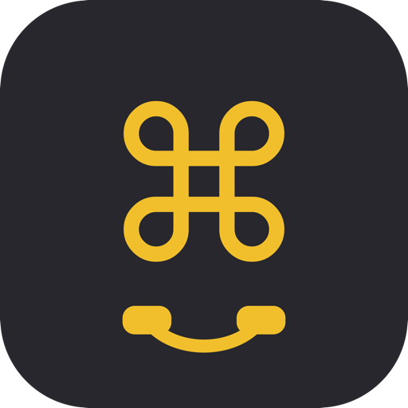

<div align="center">



# AI 接线员 · AI Commander

**用耳机的播放/暂停键，一键唤起语音输入，解放双手 vibe coding**
*Turn your headset's play/pause button into a hotkey — fire up voice input and vibe-code hands-free.*


[](https://github.com/YuJonny/AI-Commander/releases)

[中文](#中文) · [English](#english)

</div>

---

<a id="中文"></a>

## 中文

### 这是什么

**AI 接线员** 把你**耳机上的「播放 / 暂停」等媒体键**，映射成键盘上的**任意一个按键**。

最常见的用法：把它映射成语音输入软件的"按住说话 / 触发"快捷键 —— 于是你按一下耳机线控键就能开始语音输入，双手不离键盘，专注 vibe coding。

- 🎧 监听耳机的「播放 / 暂停」媒体键
- ⌨️ 映射成任意键 —— 默认 macOS = 右 Command，Windows = 右 Alt
- 🪟 常驻菜单栏 / 系统托盘，一键开关
- 🚀 支持开机自启
- 🍎 + 🪟 macOS 与 Windows 双平台

### 截图

<!-- 把截图放进 assets/ 文件夹后，取消下面的注释 -->
<!--  -->
> 截图待补充。

### 下载安装

前往 [**Releases**](https://github.com/YuJonny/AI-Commander/releases/latest) 下载：

| 平台 | 文件 |
|---|---|
| macOS | `AI接线员.dmg` |
| Windows | `AI接线员.exe` |

#### 🍎 macOS 首次打开（重要）

本应用未做苹果公证，首次打开可能提示「已损坏」或「来自身份不明的开发者」。**这是正常的，软件本身没有问题**，二选一即可：

- **简单法**：双击 App → 打开「系统设置 → 隐私与安全性」→ 在「安全性」一栏点 **「仍要打开」** → 验证。
- **兜底法（终端）**：打开「终端」，粘贴并回车：
  ```bash
  sudo xattr -cr /Applications/AI接线员.app
  ```
- DMG 里也附带了图文版「⚠️ 打不开看这里.txt」。

> 另外，macOS 需要在 **系统设置 → 隐私与安全性 → 辅助功能** 中**勾选「AI接线员」**，否则无法拦截/发送按键。

#### 🪟 Windows 首次打开

- 未签名，**SmartScreen** 会拦一下：点 **「更多信息 → 仍要运行」**。
- 杀毒软件（Windows Defender / 360 / 火绒）可能因为程序使用「键盘钩子」而**误报**，需要在杀软里把它**加入信任 / 白名单**。
- 单文件免安装，x64，Windows 10/11 双击即用，**无需管理员权限、无需安装 .NET**。

### 使用方法

1. 打开 App，确保**主开关已开启**（macOS 记得给「辅助功能」权限）。
2. 在「按键映射」里把目标键设成你想要的键（例如你常用语音输入软件的快捷键）。
3. 按耳机的「播放 / 暂停」键 —— 即触发你设定的那个键。

### 🔒 隐私与安全

这类软件需要「全局监听媒体键 + 模拟按键」，天然容易被怀疑。我们的做法是**完全开源、可审计**：

- ✅ 只拦截「媒体播放 / 暂停」**这一个键**，只发出**你配置的那一个键**；
- ✅ **不记录、不读取**你输入的任何内容；
- ✅ **不联网、不收集、不上传**任何数据；
- ✅ 核心逻辑就在 [`KeyRelay/MediaKeyInterceptor.swift`](KeyRelay/MediaKeyInterceptor.swift) 与 [`Commander-Windows/MediaKeyInterceptor.cs`](Commander-Windows/MediaKeyInterceptor.cs)，欢迎自行审查。
- ℹ️ 杀软 / Gatekeeper 之所以会提示，正是因为「键盘钩子」这个**行为本身**，与是否恶意无关 —— 源码公开，就是为了让你放心。

### 从源码构建

**macOS**（需 Xcode 命令行工具）：
```bash
./build.sh universal      # 生成通用二进制（Intel + Apple Silicon）AI接线员.app
```

**Windows**（需 .NET 8 SDK）：
```bash
cd Commander-Windows
dotnet publish -c Release -r win-x64 --self-contained true -p:PublishSingleFile=true
```

### 致谢 / 第三方组件

- Windows UI：[WPF-UI](https://github.com/lepoco/wpfui)（MIT）、[H.NotifyIcon.Wpf](https://github.com/HavenDV/H.NotifyIcon)（MIT）
- macOS 仅使用 Apple 系统框架（SwiftUI / AppKit / CoreGraphics）

详见 [THIRD_PARTY_NOTICES.md](THIRD_PARTY_NOTICES.md)。

### 许可证

[MIT](LICENSE) © 2026 Jonny Yu

---

<a id="english"></a>

## English

### What is this

**AI Commander** maps the **"play / pause" (and other media) button on your headset** to **any key** on your keyboard.

The most common use: map it to the push-to-talk / trigger hotkey of a voice-input app — so a single press of your headset's inline button starts dictation. Hands stay on the keyboard; you stay in flow, vibe-coding.

- 🎧 Listens for your headset's play / pause media key
- ⌨️ Remaps it to any key — default: **Right Command** on macOS, **Right Alt** on Windows
- 🪟 Lives in the menu bar / system tray, toggle on/off anytime
- 🚀 Launch at login
- 🍎 + 🪟 Both macOS and Windows

### Screenshots

<!-- Drop images into assets/ then uncomment -->
<!--  -->
> Screenshots coming soon.

### Download & Install

Grab the latest build from [**Releases**](https://github.com/YuJonny/AI-Commander/releases/latest):

| Platform | File |
|---|---|
| macOS | `AI接线员.dmg` |
| Windows | `AI接线员.exe` |

#### 🍎 First launch on macOS (important)

The app is **not notarized**, so the first launch may say "damaged" or "unidentified developer". **This is expected — the app is fine.** Pick one:

- **Easy way:** double-click → **System Settings → Privacy & Security** → under *Security* click **"Open Anyway"** → authenticate.
- **Fallback (Terminal):**
  ```bash
  sudo xattr -cr /Applications/AI接线员.app
  ```

You also need to enable **AI接线员** under **System Settings → Privacy & Security → Accessibility**, otherwise it can't intercept/send keys.

#### 🪟 First launch on Windows

- Unsigned, so **SmartScreen** will warn: click **"More info → Run anyway"**.
- Antivirus (Defender / 360 / Huorong) may **false-positive** because the app uses a keyboard hook — add it to your AV's **allowlist / trusted** list if needed.
- Single-file, portable, x64, runs on Windows 10/11 — **no admin rights and no .NET install required**.

### Usage

1. Open the app and make sure the **master switch is on** (grant Accessibility on macOS).
2. In **Key Mapping**, set the target key to whatever you want (e.g. your voice-input app's hotkey).
3. Press your headset's play / pause button — it fires the key you chose.

### 🔒 Privacy & Security

This kind of tool needs "global media-key listening + synthetic key events", which understandably invites suspicion. Our answer is **fully open source and auditable**:

- ✅ It intercepts **only** the media play/pause key, and emits **only** the single key you configured.
- ✅ It does **not** log or read anything you type.
- ✅ It makes **no network connections** and collects / transmits **no data** whatsoever.
- ✅ The core logic lives in [`KeyRelay/MediaKeyInterceptor.swift`](KeyRelay/MediaKeyInterceptor.swift) and [`Commander-Windows/MediaKeyInterceptor.cs`](Commander-Windows/MediaKeyInterceptor.cs) — read it yourself.
- ℹ️ AV / Gatekeeper warnings come from the **keyboard-hook behavior itself**, not from anything malicious — the source is public precisely so you can verify.

### Build from source

**macOS** (Xcode command-line tools required):
```bash
./build.sh universal      # builds a universal (Intel + Apple Silicon) AI接线员.app
```

**Windows** (.NET 8 SDK required):
```bash
cd Commander-Windows
dotnet publish -c Release -r win-x64 --self-contained true -p:PublishSingleFile=true
```

### Acknowledgements / Third-party

- Windows UI: [WPF-UI](https://github.com/lepoco/wpfui) (MIT), [H.NotifyIcon.Wpf](https://github.com/HavenDV/H.NotifyIcon) (MIT)
- macOS uses only Apple system frameworks (SwiftUI / AppKit / CoreGraphics)

See [THIRD_PARTY_NOTICES.md](THIRD_PARTY_NOTICES.md).

### License

[MIT](LICENSE) © 2026 Jonny Yu
